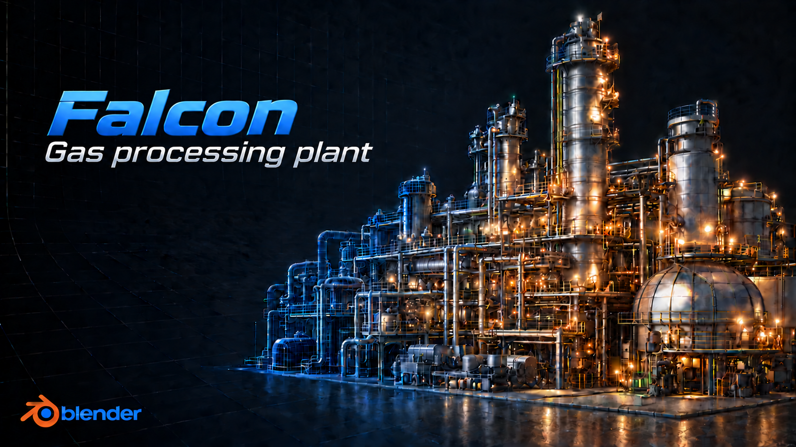

# Falcon Gas Processing Plant

## A Free Large-Scale Industrial 3D Dataset

**Falcon Gas Processing Plant** is a large, completely fictional industrial gas processing facility created for **CAD development, benchmarking, performance testing, visualization, simulation, and game development**.

With approximately **53 million triangles** and **36 million vertices**, the model is large enough to put real pressure on CAD parsers, converters, geometry pipelines, renderers, and visualization systems.

The same plant is available in multiple formats:

**Blender · FBX · OBJ · GLB**

## Downloads

Download the model files from the GitHub release page for each format:

### Blender

Native Blender source files.

[Open Blender release](https://github.com/StefanJohnsen/FalconGasProcessingPlant/releases/tag/blend)

### FBX

FBX export for DCC tools, game engines, converters, and general 3D pipelines.

[Open FBX release](https://github.com/StefanJohnsen/FalconGasProcessingPlant/releases/tag/fbx)

### OBJ

Triangle-only OBJ export with matching material files.

[Open OBJ release](https://github.com/StefanJohnsen/FalconGasProcessingPlant/releases/tag/obj)

### GLB

Binary glTF export for viewers, web rendering, engines, and compact 3D delivery.

[Open GLB release](https://github.com/StefanJohnsen/FalconGasProcessingPlant/releases/tag/glb)

All release files are available on the [GitHub Releases page](https://github.com/StefanJohnsen/FalconGasProcessingPlant/releases).

## Why I created it

In my work with industrial 3D data, I regularly need large models to measure parsing speed, memory consumption, file I/O, geometry processing, conversion performance, and rendering.

Finding suitable test data is surprisingly difficult. Large industrial models are rarely freely available, while commercial models often come with licensing restrictions that make conversion, redistribution, benchmarking, or commercial use unclear.

## So I built one

I originally created Falcon Gas Processing Plant for my own development and benchmarking. Now I am making it freely available so others don't have to solve the same problem.

## More than just a large mesh

The model has a structured **hierarchical geometry tree**, organizing the plant into areas, systems, equipment, piping, valves, instrumentation, structures, and individual components.

This makes it useful for testing not only raw geometry performance, but also **scene hierarchies, object traversal, selection, filtering, visibility, metadata, and large-model management**.

## How it was created

Falcon Gas Processing Plant was developed entirely in **Blender**, with assistance from **AI tools throughout the development process**.

AI was used as a development assistant for planning, scripting, naming, hierarchy organization, repetitive workflows, and development of the industrial layout.

The facility is completely fictional and is not derived from, scanned from, or based on any real-world gas processing plant.

## Free to use

The model is released under **CC0**. In software terms, think of it like **MIT: free to use for essentially any purpose, including commercial use.**

Use it for **CAD development, benchmarking, digital twins, game development, VR/AR, simulation, research**, or anything else where a large industrial 3D model is useful.

**No attribution required. No commercial restrictions. No permission needed.**

## Support the project

If Falcon Gas Processing Plant is useful to you, please consider **starring this repository and sharing it with others** who might find it useful.

It costs nothing and helps other developers discover the project.

**If this model saves you time, star it and help it reach the next developer who needs it.**
